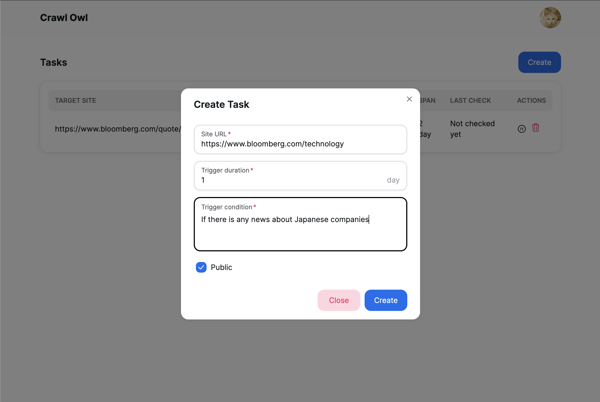

This is a frontend repository for the project ["crawl-owl"](https://crawl-owl.vercel.app/). This project enables users to get notified when websites match the conditions they set. Users can set flexible and complicated conditions by natural language.

Check out the backend repository [here](https://github.com/cheeseNA/owlback) and crawler repository [here](https://github.com/cheeseNA/crawl-owl-scrape-functions).



### How to run

Before running the project, you need to run the backend server and crawler.

```bash
$ npm install
$ npm run dev
```

To generate OpenAPI schema, modify the `generate` script to point to the `openapi.yaml` in the backend repository.
